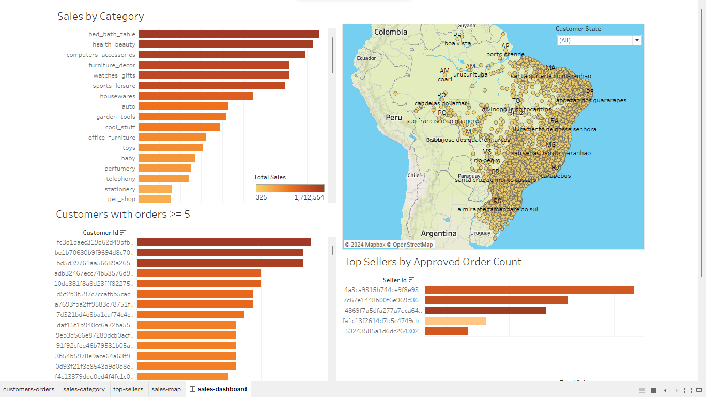

# E-Commerce Analysis Dashboard
### Project Overview:
This project involves the analysis of [Olist E-Commerce data](https://www.kaggle.com/datasets/olistbr/brazilian-ecommerce) from kaggle.com, utilizing PostgreSQL for data storage and Tableau for creating an interactive dashboard. The primary goal is to visualize key performance indicators and insights from the dataset.

### Task Description:
- Build a dashboard with overall business performance indicators, including a sales chart (quantity and total amount).
- Identify and display the top 5 companies based on sales for the specified period.
- Visualize sales on a map, depicting regions and cities.
- Highlight customers with orders equal to or greater than 5.
- Display sales by categories.
- Build a dashboard with overall business performance indicators, including a sales chart (quantity and total amount).

### Tools Used:
- [PostgreSQL](https://www.postgresql.org/docs/) for data storage
- [Tableau](https://public.tableau.com/app/discover) for dashboard creation

### Data Source: 
- kaggle.com/datasets/olistbr/brazilian-ecommerce 

### Dashboard
